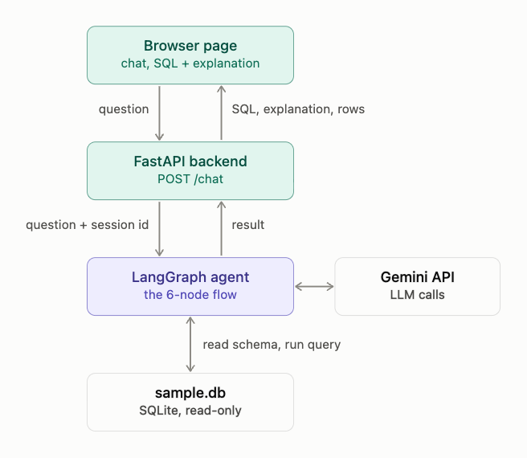

# SQL Query AI Agent

A chat assistant that turns plain English into SQL for **one specific database**. It explains the query, checks it, runs it, and refuses anything outside that database.

- **Live app:** (https://sql-agent-production-ac96.up.railway.app/)
- **Stack:** LangGraph, Gemini (`gemini-3.5-flash-lite`), FastAPI, SQLite, one HTML page

## What it can do

- Natural language to SQL 
- Follow-ups that change the previous query 
- Optimize or debug a SQL query you paste in
- Plain-English explanation of every query
- Runs the query and shows the rows (max 100)
- Refuses destructive requests and anything not about this database

## Architecture



## Workflow


| Node | What it does |
|---|---|
| `classify` | One Gemini call that picks an intent: generate, optimize, debug, destructive, out_of_scope, clarify or intro |
| `reject` | Fixed replies for refusals, greetings, clarifying questions, or after 3 failed attempts |
| `generate` | Gemini writes (or optimizes / debugs) the SQL using the database schema |
| `validate` | Plain code: SELECT only, no write keywords, then SQLite checks tables, columns, joins and syntax |
| `execute` | Runs the query on a read-only connection |
| `explain` | Gemini explains the final query in simple words |

If `validate` fails, the error goes back to `generate` (up to 2 retries). Conversation memory is kept per session with a SQLite checkpointer, which is how follow-ups work.

## Guardrails

- The classifier only sees table names, and refuses general SQL questions, general knowledge and other topics
- Generated SQL must be a single SELECT with no write keywords
- The database is opened read-only, so nothing can be changed even if a check is missed
- Tables and columns are verified by SQLite, so invented ones are caught and retried
- The user message is treated as data, with an instruction in the prompt to ignore attempts to change the rules

## Run locally

```bash
git clone <repo link>
cd <repo folder>
python -m venv venv
source venv/bin/activate        # Windows: venv\Scripts\activate
pip install -r requirements.txt
```

Create a `.env` file:

```
GOOGLE_API_KEY=your_key_from_aistudio
```

Start the app and open http://127.0.0.1:8000

```bash
uvicorn main:app --reload
```

Optional variables: `DB_PATH` (default `sample.db`) and `CHECKPOINT_PATH` (default `agent_checkpoints.db`). To use a different database, replace `sample.db` and restart.

## Sample database

`sample.db` (SQLite) has four tables:

```
Departments(DeptID, DeptName)
Employees(EmployeeID, Name, HireDate, Salary, DeptID)   DeptID -> Departments.DeptID
Customers(CustomerID, Name, State)
Orders(OrderID, CustomerID, OrderDate, Amount)           CustomerID -> Customers.CustomerID
```

## Assumptions

- The agent works with one fixed database. To use another, replace the file.
- General SQL questions ("what is a JOIN?") are refused on purpose. The agent only helps with this database.
- Read-only: no INSERT, UPDATE, DELETE, DROP, ALTER or TRUNCATE, ever.
- Results are limited to 100 rows.
- Each browser page load starts a new conversation. Conversations are stored in a local SQLite file, which may be wiped when the server redeploys.
- The deployed app uses Gemini API key from Railway's environment variables.
