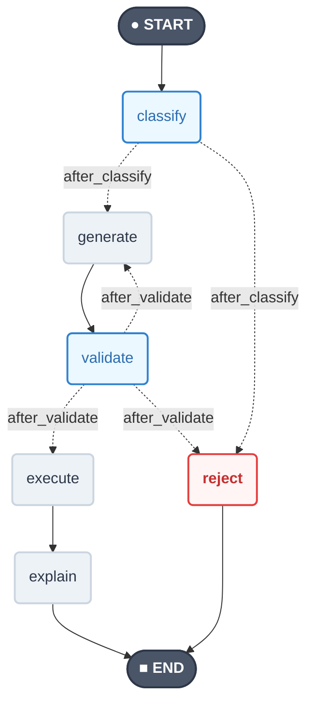

```mermaid
graph TD
    %% Styling Definitions
    classDef startEnd fill:#4A5568,stroke:#2D3748,stroke-width:2px,color:#FFF,font-weight:bold;
    classDef nodeStyle fill:#EDF2F7,stroke:#CBD5E0,stroke-width:2px,color:#2D3748;
    classDef conditional fill:#EBF8FF,stroke:#3182CE,stroke-width:2px,color:#2B6CB0;
    classDef terminal fill:#FFF5F5,stroke:#E53E3E,stroke-width:2px,color:#C53030,font-weight:bold;

    %% Nodes
    START([● START]):::startEnd
    classify(classify):::conditional
    generate(generate):::nodeStyle
    validate(validate):::conditional
    execute(execute):::nodeStyle
    explain(explain):::nodeStyle
    reject(reject):::terminal
    END([■ END]):::startEnd

    %% Flow Layout and Edges
    START --> classify
    
    %% Classify Routing
    classify -.->|after_classify| generate
    classify -.->|after_classify| reject
    
    %% Generation and Validation Loop
    generate --> validate
    validate -.->|after_validate| execute
    validate -.->|after_validate| generate
    validate -.->|after_validate| reject
    
    %% Completion Path
    execute --> explain
    explain --> END
    reject --> END
```

